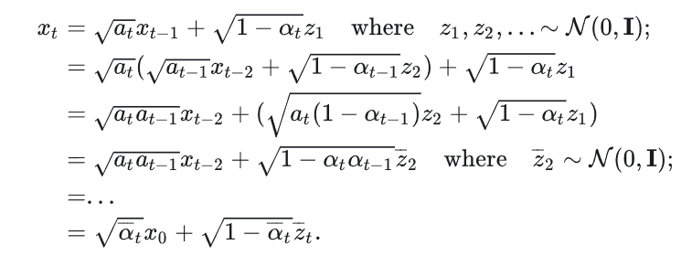
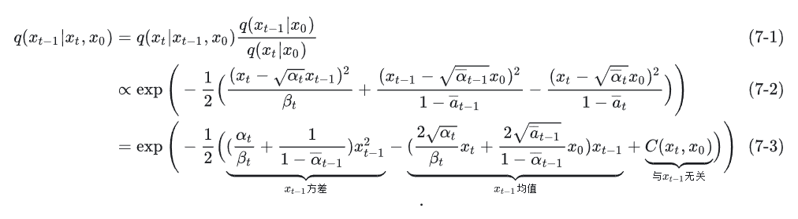
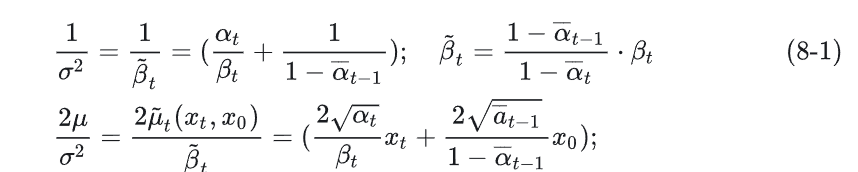
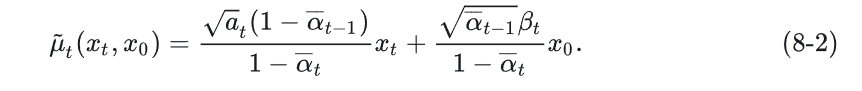
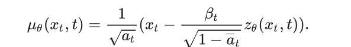
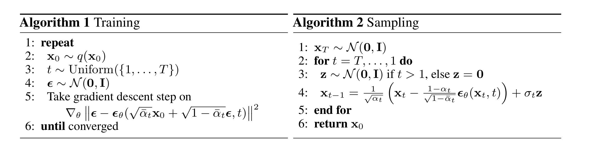

扩散模型的开山之作[Denoising Diffusion Probabilistic Models](https://arxiv.org/abs/2006.11239)。这篇帖子并不把重心放在详细的公式推导上，在看见树木之前我们最好先看得见森林。

# 什么是diffusion model?
现在假如我们想要生成一张256x256x3的图片，那么我们需要知道其中每一个像素点需要安放在哪一个位置上。换句话说，我们需要得知像素$x$和其对应位置$p$之间的函数关系$f(x)$。但事实上这个分布函数是非常复杂，或者几乎是不可能获取的。

这时候我们就需要换一种思路，**找到能够满足我们的数据分布的基本似然函数**。这就是diffusion model的最初构想。diffusion model（扩散模型）来源于物理学中热力学扩散的概念，核心有正向扩散和反向扩散两部分，分别对应加噪和去噪的过程。扩散模型的核心思想来源于模拟物质在空间中的扩散过程，只不过在具体任务中“物质”对应的是样本点，“空间”指的是数据空间。

# 正向扩散
为什么要加噪（正向扩散）呢？因为原有的图像数据具有非常复杂的特征，数据分布难以把握，加噪可以简化训练流程，对图像加噪最后形成纯高斯噪声的过程也是一种数据加强的过程，模型更容易学习到鲁棒的图像特征。同时加噪过程也可以看做是一个马尔科夫链，每一步加上去的噪声都是基于当前状态的。在一步步加噪过程中模型的学习量更丰富，训练过程更稳健。

# 反向扩散
反向扩散是正向扩散的逆过程，也可以看做逆马尔科夫链，逐步从当前的数据中去处噪声直到恢复原来的数据分布。每一次去噪都基于当前的状态，在去噪过程中模型就可以有效学习数据的核心特征，并学习如何一步步从完全随机的状态出发，复原得到原始图片或者生成其他的图片。

# 扩散细节
#### 前扩散核与反向扩散核
$q(x_t|x_{t-1})$是前扩散核，表示在已知给定图像$x_{t-1}$的情况下推出新加噪图像$x_{t}$的过渡函数。同样地，反扩散核$p_{\theta}(x_{t-1}|x_t)$表示模型在通过降噪还原图像的时候，已知$x_{t}$的条件下推出$x_{t-1}$分布的过渡函数，$\theta$表示模型学习反向扩散过程分布的参数。

#### 正向扩散的细节
正向扩散可表示为一个马尔科夫链，定义为：
$$q(x_t|x_{t-1}) = \mathcal{N}(x_t; \sqrt{1-\beta_t}x_{t-1}, \beta_tI)$$
$$q(x_{1:T}|x_0) = \prod_{t=1}^T q(x_t|x_{t-1})$$

首先从数据集中获取一张图像$x_0$，模型需要对其累加噪声$T$次获得$x_{1},x_{2},x_{3}......x_{T}$，这里再额外给定中间叠加噪声的高斯分布方差超参数${\beta_{t}\in(0,1)}_{t=1}^{T}$.随着t的增大，x越来越接近纯高斯噪声。每一步更新的xt都可以看做是与原本的$x_{t-1}$有一定关联，但是又在原基础上叠加了一定的噪声。各个时间段的图像为各向同性高斯分布。

在diffusion正向扩散过程中能通过$x_{0}$和$\beta$直接计算$x_{t}$对于快速扩散非常重要。但是在正式开始计算之前，我们还需要引入另一个概念：重参数。重参数在众多技术中都有应用（gumbel softmax, VAE）。重参数（reparameter）的初衷是，如果我们需要从某一个分布中随机选取一个样本，这样的选取方式是无法计算梯度的。例如我们先前约定的加噪过程，每次随机加上的$\beta_{t}$满足高斯分布，但是对于$\beta$的梯度我们无从计算。因此我们可以通过引入另一个变量将随机性引导过去，来使得式子可微。例如还是从高斯分布中选取一个样本（约定叫做$z$）这个例子，我们通过引入$\epsilon$将式子改写成这样：
$$z = \mu_\theta + \sigma_\theta \odot \epsilon, \epsilon \sim \mathcal{N}(0, \mathbf{I})$$
整个采样过程依旧可导，但是随机性被转嫁到了$\epsilon$上。

了解了重参数技术，我们现在将它应用于往数据上一步步加噪的过程。现在开始正向扩散过程精确计算每一步$x_{t}$的推导。

约定：$a_{t}=1-\beta_{t}$,并且$\overline{\alpha}_t = \prod_{i=1}^{T} \alpha_i$(当然对z也是同理)，将$x_{t}$展开：

#### 反向扩散的细节
反向扩散是正向扩散的逆过程，它不太像和正向扩散一样独立进行的运算，它更像是正向扩散的完全逆过程，登山路途中的按照原路返回。意思是我们需要一步步“撤销”正向传播的操作。和FDK一样，我们也使用高斯分布来定义RDK的参数情况。如果一步步按部就班的删除加上的噪声，我们就会回到原始分布；而在中间学习新的轨迹，我们就能学习如何从纯高斯噪声开始生成相似的但是全新的样本。

本质上反向扩散就是逐步得到逆转之后的$q(x_{t-1}|x_{t})$。直接求得分布是困难的，因此使用RDK预测这样一个逆向的分布$p_{\theta}$. 对于每一次去噪，本质是让模型学习一个条件分布$p_{\theta}(x_{t-1}|x_{t})$.这个分布通常被假设为高斯分布：
$$q(x_{t-1}|x_t, x_0) = \mathcal{N}(x_{t-1}; \tilde{\mu}(x_t, x_0), \tilde{\beta}_t \mathbf{I})$$
展开如下：

可以发现(7-1)将过程由逆向又转换成了前向。再根据：
$$exp \left( -\frac{(x-\mu)^2}{2\sigma^2} \right) = exp \left( -\frac{1}{2} \left( \frac{1}{\sigma^2} x^2 - \frac{2\mu}{\sigma^2} x + \frac{\mu^2}{\sigma^2} \right) \right)$$

我们对（7-3）稍作整理可以得出来$\tilde{\mu}(x_t, x_0)$的值(之前提过，$x_{t-1}的均值就是这个函数$):

联立解得$\mu$为：

我们知道$x_{t}$是可以仅由$t$和$x_{0}$算出来的，那么代入有：

总结一下，反向扩散的过程可以总结为：
- 首先通过$x_{t}和t$预测噪声$z_{\theta}(t)$(后期在神经网络学习如何预测)，并计算得出$\mu(x_{t},x_{0})$.
- 至于方差，通常认为$\tilde{\beta}_t = \frac{1 - \alpha_{t-1}}{1 - \bar{\alpha}_t}$代入计算。在GLIDE中采用另一种范式。
- 得到$q(x_{t-1}|x_{t})$, 利用重参数得到$x_{t-1}$。

# 训练扩散
这部分的公式非常非常多，具体细节可以看论文原文，在此仅总结论文提供的流程，够用。

总体来说训练是：
1. 获取输入 $( x_0 )，从 1...T 随机采样一个 ( t )$.
2. 从标准高斯分布采样一个噪声 $( \bar{z}_t \sim \mathcal{N}(0, I) )$.
3. 最小化 $( ||\bar{z}_t - z_\theta(\sqrt{\bar{\alpha}_t} x_0 + \sqrt{1 - \bar{\alpha}_t} \bar{z}_t, t)|| )$.

整体流程如上。稍微具体地，优化过程中我们定义使用VLB或等价的KLB散度来定义损失函数：
$$\mathcal{L}_{\mathrm{VLB}} = \mathbb{E}_q \left[ \log \frac{p_\theta(x_0 | x_T)}{q(x_T | x_0)} \right]$$
优化其中参数$\theta$。依据流程：
$$x_{t-1} = \frac{1}{\sqrt{\alpha_t}} \left( x_t - \frac{\beta_t}{\sqrt{1 - \bar{\alpha}_t}} \epsilon_\theta(x_t, t) \right)$$.
最终得到原数据。

