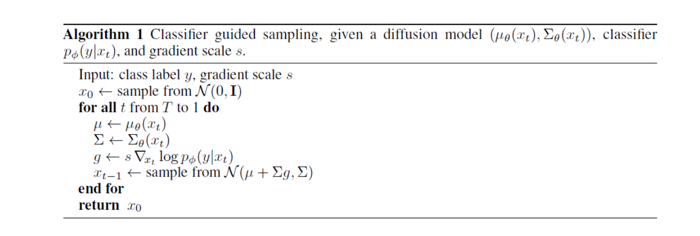

两种改进diffusion model的方法，思路相反，分别利用和去除classifier guidance.首先我们看带有分类器指引的，再看不带分类器指引的。

尽管最近的diffusion model大火，但是GAN在图像生成的质量方面依然占据着高地。《Diffusion Models Beat GANs on Image Synthesis》通过引入classifier guaidance 增强diffusion model生成图像的质量，终于在关键生成任务上超过了GAN。

在原来扩散模型的基础上，原文通过引入KL散度约束预测$p_{\theta}(x_0)$和$q_{\theta}(x_0)$之间的变分差距也就是$L_{vlb}$。与原本损失函数拼接成为新损失。

# classifier guidance
现在将图像类别信息引入训练过程。想法是将$x_{t}$步骤的图像输入分类模型中，利用分类模型的梯度信息$\nabla_{x_t} \log p_{\theta}(x_t)$返回噪声预测和采样过程。

在DDPM中，每一次对$x_{t-1}$的预测都依靠这个式子：
$$\mu_{\theta}(x_t, t) = \frac{1}{\sqrt{\bar{\alpha}_t}} \left(x_t - \frac{1 - \alpha_t}{\sqrt{1 - \bar{\alpha}_t}} \epsilon_{\theta}(x_t, t)\right)$$

经过推导可将下面这个式子代替上面的噪声：
$$\hat{\epsilon}(x_t) := \epsilon_{\theta}(x_t) - \sqrt{1 - \tilde{\alpha}_t} \nabla_{x_t} \log p_{\phi}(y | x_t)$$

该式在预测噪声的过程中成功利用了分类模型的梯度信息。这一个思路是噪声预测思路。还有一种思路是分类器指引。这个思路和使用分类器帮助噪声预测类似，都是修改预测噪声高斯分布的均值。

具体地，引入超参数$s$量化分类器指引程度。