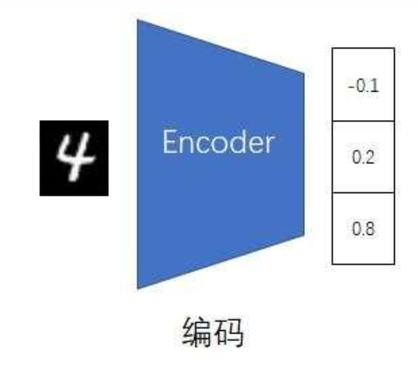
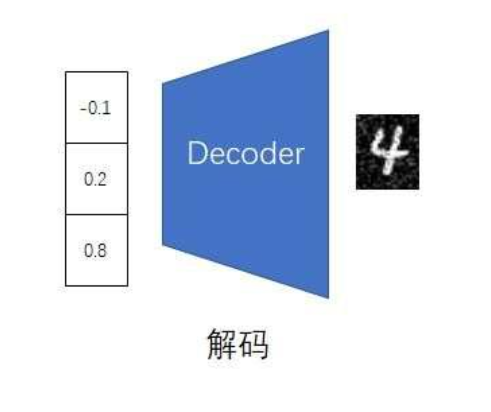
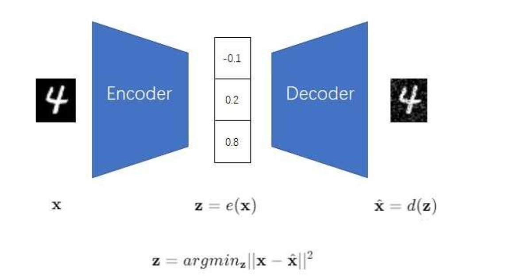
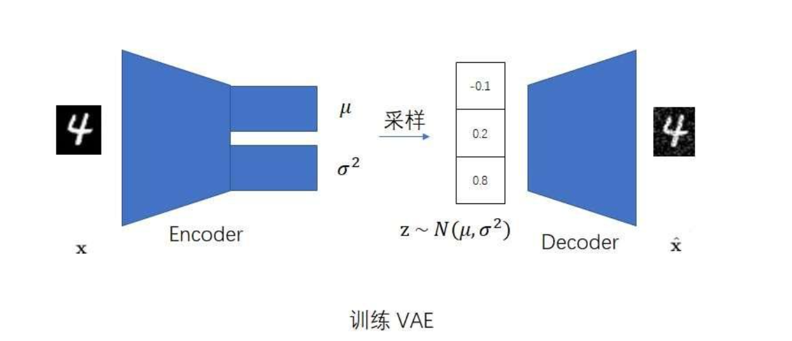
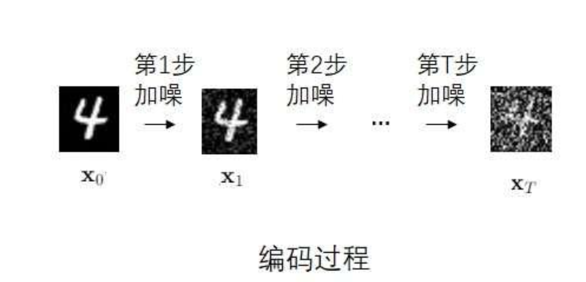
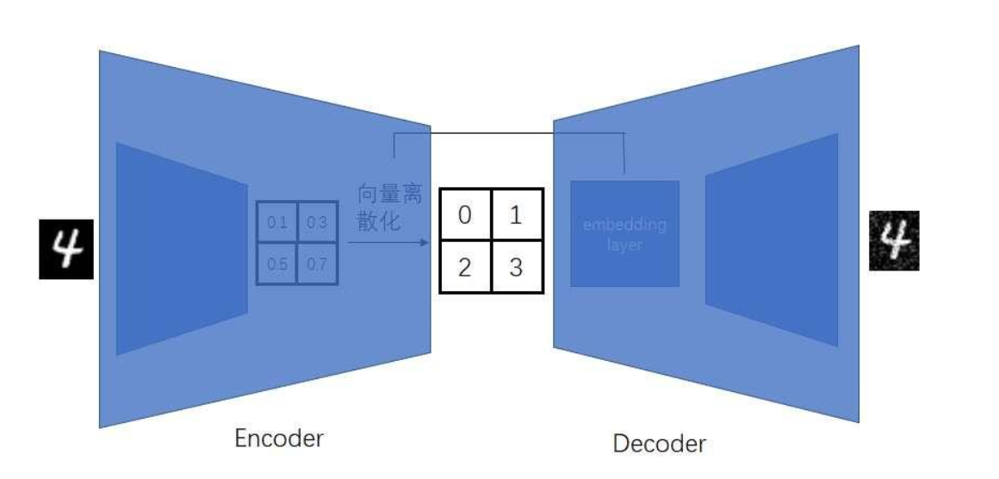

Stable Diffusion 是当前最受欢迎的Image generative model，主要原因就是SD model极大提升了diffusion model生成图像的效率，令用户可以在自己的商业级显卡上生成图像。在正式学习SD之前，我们不妨从更原始的图像生成模型开始了解。

# Autoencoder
包括diffusion model在内的众多生成式模型其实本质上都可以看做是最简单的Autoencoder(AE)的改进版。所以索性我们从AE开始了解。

生成图像的原理是，首先将图像压缩，然后基于这个压缩的图像生成新的图像。可以看做这是两个映射，分别是：$图像 → 数据$和$数据 → 图像$。既然神经网络能拟合任何分布，那我们就用神经网络来学习他们的映射是什么。于是一个负责编码的叫编码器（encoder），一个负责解码叫做（decoder）。

如图：

此时我们的学习目标就很明确了：我们希望让模型可以将一张图片压缩再复原，并且复原效果不错，和原来的图片差不多。只要我们提供一张原图像并接受生成出来的图像，就能对模型进行训练而不需要打上标签，整个过程是自监督的。也就是autoencoder(AE)。如下图：

这就是最初的AE的设想。但是不难发现，AE存在很严重的过拟合倾向--自编码器很可能只认得训练时提供的压缩数据，例如当我们在训练流程中向编码器提供图片被压缩的数据（比如记作一个数字，1）后，AE在解码过程中学习如何对数字1生成尽可能和原来一样的图像，但是在实际应用时遇到另一个输入（例如数字2），就会不知所措，因为AE只知道怎么将输入“1”解码。后期解决问题的思路主要分成两类--解决AE的过拟合倾向，和利用AE压缩图像，使用压缩结果生成其他模型。

# 克服AE的过拟合倾向（DDPM和VAE的思路）
先来看variational autoencoder（变分自编码器，VAE）的思路。VAE的想法是，现在不让AE的encoder输出一个确定的值，而是输出一个在一定区间内的变量，例如同时输出均值和方差。这样的策略防止了AE的decoder死记硬背。另一方面是VAE限制编码器必须学习产生尽可能和正太分布相似的分布，换句话说需要尽可能地将图像压缩输出转换为一个符合正态分布的变量。这是因为我们在生成图像的时候通常也是从正态分布中随机采样的，因此需要让encoder的输出对齐。

因此VAE的训练任务有两个。首先最小化encoder的输出和正态分布之间的差别；其次最小化生成图像和原图像的差距。损失函数表示为：
$$loss: (|\hat{x} - x\|^2 - sim(N(\mu, \sigma^2), N(0, I)))$$

其中的分布与分布之间的差距可以用一个指标叫做KL散度来衡量，因此VAE的改动也可以被看做正则化方法，称之为KL正则化。

但是VAE对重建生成的图像的约束条件少，生成图像的质量其实不高。主要因为VAE的编码和解码过程都用的神经网络，中间过程可解释性太差，我们只能对编码器的输出（一个正态分布）和解码器的输出（生成的图像）加以限制。对此涌现了对VAE进行改进的新方法--diffusion model DDPM，以对具体的解码编码过程加上更多的限制。

DDPM的想法是：既然VAE的目标是输出一个正态分布，不断加噪也可以达到这个目的，那干脆就直接用一个完全可知的加噪过程取代encoder神经网络给出正态分布。

既然加了噪，那么现在decoder的任务就是去噪。decoder也不是一个解释不清的神经网络了，而是预测每个去噪步骤的网络。DDPM的核心是第t个去噪操作尽可能地抵消第t个加噪操作。详细原理可以在[Paper-reading-DDPM专栏](https://www.void2024.top/posts/Denoising%20Diffusion%20Probabilistic%20Models)中看。

总的来说DDPM将VAE干的事分成这几个步骤：
- 将生成正态分布的过程转换为一个完全可控的加噪过程。（不可学习）
- 将生成过程转换为一个可学习的去噪过程。
- 每一次加噪去噪对整张图片操作（操作尺寸不变）。

但DDPM也有问题。尤其明显的是DDPM加噪去噪过程环环相扣，一步跟一步耗时长，而且每次加噪去噪针对一整张图片进行操作，计算资源消耗非常大。

# 利用AE的图像压缩功能
由于AE的过拟合倾向，干脆不用AE生成图片，而专职压缩图片，再使用其他模型根据压缩结果生成图像。这就是Vector Quantised-Variational AutoEncoder (VQVAE) 的思路。

在这里AE的encoder需要进行一些修改。AE的编码器需要输出一个离散向量。这是因为transformer等模型只能输出离散图像，所以必须进行对齐。具体让AE输出离散向量的方法是，依然令编码器输出连续向量，但是通过某种离散化操作将其映射为离散向量对齐到嵌入层的向量上。具体地，AE输出的离散向量是一个二维的向量，可以理解为是将原图像按照一定比例缩小的离散“小图像”。

训练时，首先训练VQVAE模型，然后训练一个压缩图片生成模型（例如transformer）；生成图像时，使用transformer等生成一个压缩图像，然后使用VQVAE的解码器按照压缩图像生成真实图像。之所以不直接用transformer来生成原本大小图像，而只让他生成压缩图像的原因是，运算次数与像素平方数成正比，计算开销太大。但是使用AE压缩一下的话，开销就能减少。将VQVAE的嵌入向量和后续解码部分视为一个模块的话，可以认为VQVAE对VAE方法使用了正则化技术，也称VQ正则化。

**现在我们正式开始介绍SD模型。**

# Abstract & Intro
以往尽管扩散模型在像素空间中取得了惊人的效果，但是扩散模型的计算开销实在太大。对此论文提出了一种隐式扩散模型，能够很好地平衡图像压缩和尽可能生成高质量细节丰富图像。LDM借鉴了VQVAE的思路，“先压缩，再生成”，将图像压缩，解码器学习如何从压缩图像生成真实图像，然后再来一个模型学习如何生成压缩图像。

还有一件有趣的事，作者发现在DDPM反向去噪生成图像的过程中，前半部分主要集中于生成关键的语义信息，而后半部分的去噪只是令生成图像在细节上有更多不同。因此我们有了一个朴素的想法--干脆直接让DDPM只负责前面的关键语义信息生成，后面的交给VAE足矣。

我们后面的重点放在两方面：第一，LDM的AE是如何设计的，达到了压缩和生成图像质量的平衡。第二，LDM是如何利用交叉注意力机制达到带约束的图像生成的。

# Method

