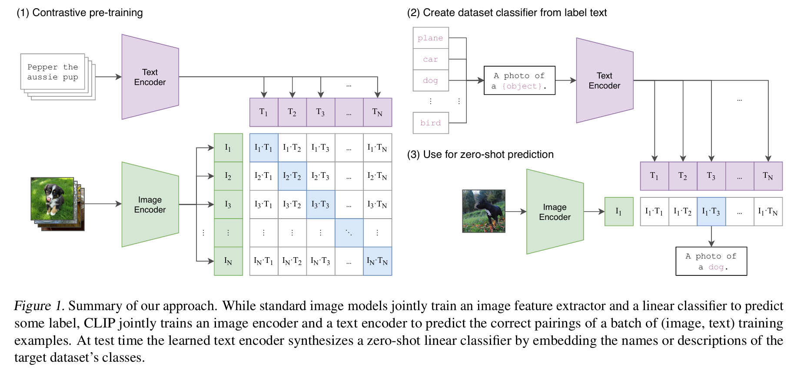

一句话概括，clip介绍了一种将自然语言监督引入计算机视觉领域的方法（或者说，一类新的encoder）。为后面包括LDM等工作使用自然语言作为约束引入图像生成提供了启发。

# Abstract & Intro
NLP领域，使用web-scale级别的数据进行训练取得了巨大成功，但是在计算机视觉领域，使用人工标记的高质量数据集训练依然是主流做法。文章的动机就是能否像NLP领域一样，将文本学习引入到图像学习中，使得模型可以学习到对图像更加丰富的表征学习？

引入文本增强对图像的学习好处有这几个：
- 数据集庞大，可以轻松获得；
- 自然语言描述能力很强，使用自然语言加强图像学习可以使模型不仅学习的是一个表征，而是将表征和语言联系起来，实现灵活的zero-shoting。

# Datasets
该方法贡献还有一个，就是提供了高质量的text-image对数据集。尽管先前已经有一个庞大的图文数据集YFCC100M，但是数据集质量堪忧，其中也有大量甚至不带文本的图像数据。对他们进行选择，最终只得到了1500万张图片，这显然都不是很好的选择。因此作者从网络中构建了全新的文本-图像对数据集WIT，包含四亿对数据。

# Pre-training method
最开始，文章的想法是选择Vir-Tex之类类似的方法，使用从零开始训练一个识别图像的模型（CNN,RESNET）和一个进行文本处理的模型（transformer），但是后来发现训练效率（选择预训练方法时将这一项作为重要指标）十分不好。因此作者调转方向，不去训练预测模型，而是一个对比模型，预测一个图像和一个文本是不是属于一个pair。

具体实现如下。由于输入的是文本-图像对（假设有n个图像，n个描述文本），因此随意组合共有$n^2$中组合，除了其中原本正确的$n$个组合为正确之外（我们约定这些搭配是正样本），剩下的$n^2-n$都是负样本。训练策略即最大化$n^2$个匹配中$n$个匹配的余弦相似度，最小化$n^2-n$个负样本的相似度。

大致结构是，使用分别的图像处理模型和文本处理模型将图像和文本数据映射到$embedding space$中（只通过线性映射），接着通过匹配成不同的对然后训练。

模型选择方面，image encoder使用了resnet-50, text-encoder使用了transformer。

