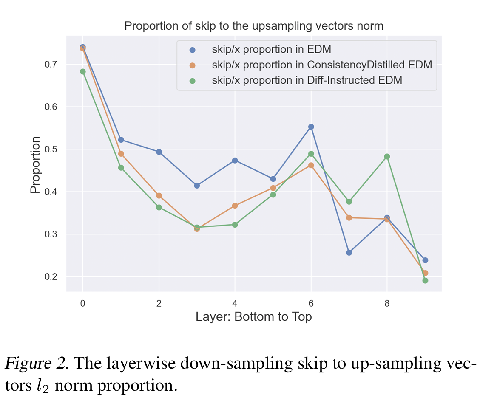
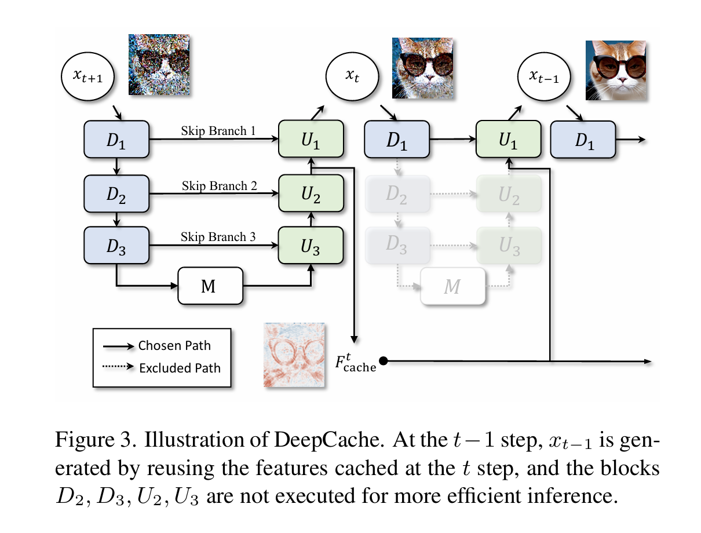

# The Surprising Effectiveness of Skip-Tuning in Diffusion Sampling
正式开始之前首先我们需要先学习目前有很多ODE-based 扩散模型使用了U-net来帮助预测噪声。在这种结构下，时间信号被转换为time-embedding送入U-net的输出，这样U-net就能预测针对原图像和不同时段，加在图片上的噪声。

U-net中的skip-connection加强了U-net的拟合能力，但是我们必须意识到，这同时也埋下了隐患。U-net的最高输入层和最低输出层直接相连，这可能导致U-net的非线性拟合能力下降（最高和最低层的skip-conncetion可以认为在某种程度上将模型弱化为了一个线性模型，直接输入并直接输出）。

中间做了一下具体测试，对DMP中U-net分别收集下采样特征向量（编码器部分）和上采样特征向量（解码器部分）的范数之比：

$$prop_{i} = ||d_{i}||_{2} / ||u_{i}||_{2}$$

得到如下图：

可以看见在众多ODE-based diffusion model中，尤其是在经过蒸馏的ODE-based model中，下采样特征向量的范数明显弱于上采样过程。这对于push-forward transformation不利。为了克服这种影响，便提出对U-net的每一层进行加权：

$$\Delta\rho = \frac{(\rho_{top} - \rho_{bottom})}{k}, \quad \rho_i = \rho_{bottom} + \Delta\rho \cdot i.$$

本质上是对U-net的不同层加以不同权重，来缓解由于skip-connection导致的对push-forward的影响。

# DeepCache: Accelerating Diffusion Models for Free
我们已经基本了解了U-net在扩散模型中的应用--主要用于学习噪声，在采样过程中去噪。对于采样过程中U-net的去噪学习过程而言，我们还是认为计算损失太大了，U——net的多层结构，经过层层计算的开销还是不小。与此同时我们发现在去噪过程中，相邻几步的U-net学习到的噪声特征，尤其是在深层，几乎是一样的，这篇论文基于这个发现提出了一种方法：使用一个cache结构存储$x_{t}$步时对应的U-net深层得到的特征，在后面相邻的k步直接使用cache存储的特征去噪，就不用再额外学习了。

示意图如下：

# DPM-Solver-A Fast ODE Solver for Diffusion Probabilistic Model Sampling in Around 10 Steps

  

在若干步之内完成DPM反向去噪的过程，极大加速训练流程。

  

  

已经有若干研究将DPM的反向去噪过程作为求解ODE方程推进。这篇论文额外指出了ODE解可以分为线性和非线性部分，而以往的工作忽略了这一点，直接对所有方程进行求解。本论文通过解析地计算线性部分，得到了扩散ODEs解的精确公式。同时通过变量代换将解中的非线性部分转换为神经网络的指数加权积分形式。这部分可以用弄指数积分器来高效近似。

  

  

#### Related work

  

原本的预训练过程中的加噪过程是：

  

  

$$q_{0t}(x_t | x_0) = \mathcal{N}(x_t | \alpha(t) x_0, \sigma^2(t) I),$$

  

  

后被证明可以被转换为微分方程形式：

  

  

$$dx_t = f(t)x_t dt + g(t)dw_t, x_0 ~ q_0(x_0),$$

  

  

并有这样的逆过程去噪形式：

  

  

$$dx_t = [f(t)x_t - g^2(t)∇_x log q_t(x_t)]dt + g(t)dw_t, x_T \sim q_T(x_T),$$

  

  

其中$\hat{w_{t}}$是逆时间的标准维纳过程，而且：

  

  

$$f(t) = frac{d log alpha_t}{dt}, g^2(t) = frac{d sigma_t^2}{dt} - 2 frac{d log alpha_t}{dt} sigma_t^2.$$

  

  

其中唯一未知的是$\nabla_x \log q_t(x_t)$, 通常转换为$-\epsilon_\theta(x_t, t) / \sigma_t$,交给神经网络学习。

  

  

限制SDE采样速度的主要是维纳过程，因此有工作试图消除这一影响，具体来说，他们将概率流ODE转换成这种形式：

  

  

$$\frac{d x_t}{d t} = f(t) x_t - \frac{1}{2} g^2(t) \nabla_t \log q_t(x_t)$$

  

  

和上文一样，将得分函数使用噪声预测模型来取代，我们自然而然得到这个参数化的ODE方程，也叫diffusion ODE:

  

  

$$\frac{d \mathbf{x}_t}{d t} = \mathbf{h}_{\theta}(\mathbf{x}_t, t) := f(t)\mathbf{x}_t + \frac{g^2(t)}{2\sigma_t}\boldsymbol{\epsilon}_{\theta}(\mathbf{x}_t, t), \quad \mathbf{x}_T \sim \mathcal{N}(0, \tilde{\sigma}^2 I).$$

  

  

使用精心设计的ODE求解器可以快速求解ODE方程。但是目前针对更少的步数(例如十步以内)的生成质量不佳，因此尝试探索更巧妙的ODE求解器。

  

  

#### Method

  

先前的ODE求解策略是：直接将整个方程$h(x,t)$交给求解器计算，但是忽略了ODE的形式可以分为两部分：左侧$f(x)x_{t}$可以看成线性部分，而右侧是和神经网络有关的非线性部分。

  

  

通过常数变换公式将原形式转换为如下：

  

  

$$x_t = e^{ \int_s^t f(\tau) d\tau } x_s + \int_s^t e^{(t-r)f(r)} g^2(r) \nabla_x \log q_r(x_r; \theta) dr （1）$$

  

  

左侧是精确的积分部分可以计算，右侧是非线性部分。引入特殊变量：$λ_t := \log(α_t / σ_t)$(信噪比的一半)，将$g^{2}(t)$重写：

  

  

$$g^2(t) = \frac{\mathrm{d}\sigma_t^2}{\mathrm{d}t} - 2\frac{\mathrm{d}\log\alpha_t}{\mathrm{d}t}\sigma_t^2 = 2\sigma_t^2\left(\frac{\mathrm{d}\log\sigma_t}{\mathrm{d}t} - \frac{\mathrm{d}\log\alpha_t}{\mathrm{d}t}\right) = -2\sigma_t^2\frac{\mathrm{d}\lambda_t}{\mathrm{d}t}.$$

  

  

把先前对$f(t)$一起带进来，就将（1）式转换为：

  

  

$$x_t = frac{x_s}{alpha_s} - alpha_t int_S^t (frac{dlambda_T}{dT}) frac{sigma_T}{epsilon_theta(x_T, T)dT}$$

  

  

使用$\lambda$将方程重写：

  

  

$$[ x_t = \frac{\alpha_t}{\alpha_s} x_s - \alpha_t \int_{\lambda_s}^{\lambda_t} e^{-\hat{\epsilon}_\theta(\hat{x}_\lambda, \lambda)} d\lambda. ]$$

  

  

对噪声部分做泰勒展开：

  

  

$$\hat{e}_{\theta}(\hat{x}_{\lambda}, \lambda) = \sum_{n=0}^{k-1} \frac{(\lambda - \lambda_{t_i-1})^n}{n!} \hat{e}_{\theta}^{(n)}(\hat{x}_{\lambda_{t_i-1}}, \lambda_{t_i-1}) + \mathcal{O}((\lambda - \lambda_{t_i-1})^k),$$

  

  

再代入：

  

  

$$\mathbf{x}_{t_{i-1} \rightarrow t_i} = \frac{\alpha_{t_i}}{\alpha_{t_{i-1}}} \tilde{\mathbf{x}}_{t_{i-1}} - \alpha_{t_i} \sum_{n=0}^{k-1} \hat{\boldsymbol{\epsilon}}_{{\theta}}^{(n)} (\hat{\mathbf{x}}_{\lambda_{t_{i-1}}}, \lambda_{t_{i-1}}) \int_{\lambda_{t_{i-1}}}^{\lambda_{t_i}} e^{-\lambda} \frac{(\lambda - \lambda_{t_{i-1}})^n}{n!} d\lambda + \mathcal{O}(h_i^{k+1}),$$

  

  

前面部分是全导数部分，后面是系数部分（标量），后面的全导数部分直接用传统ODE求解器也可以算。