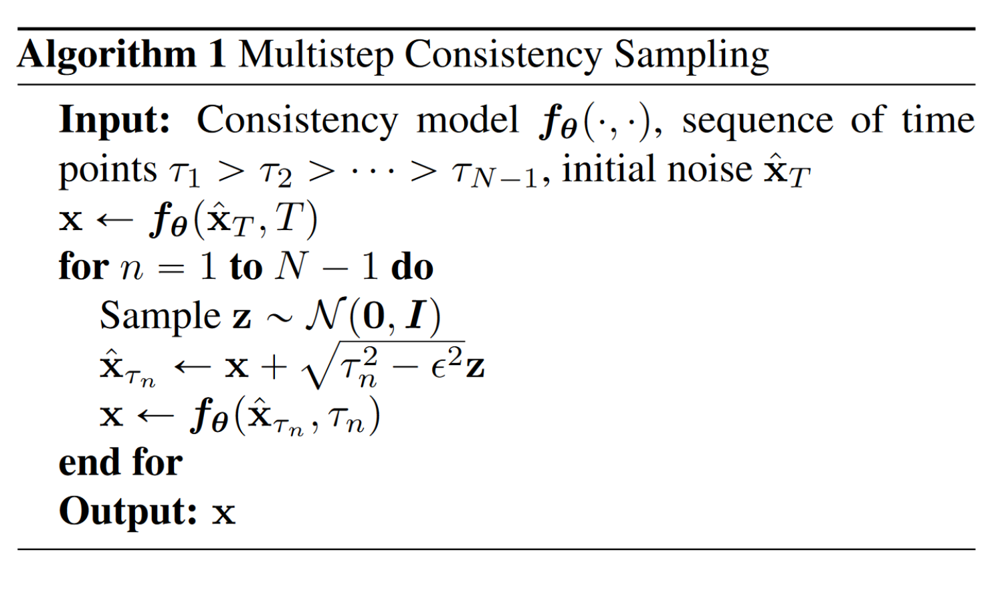
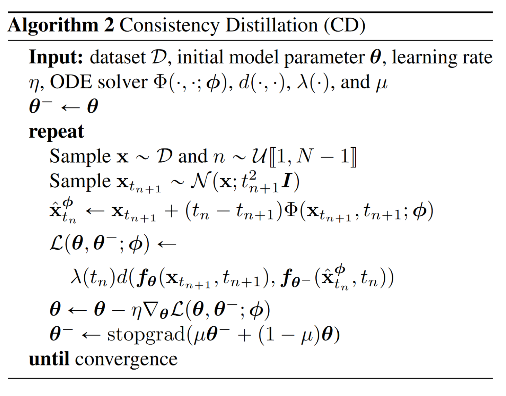

# The Surprising Effectiveness of Skip-Tuning in Diffusion Sampling
正式开始之前首先我们需要先学习目前有很多ODE-based 扩散模型使用了U-net来帮助预测噪声。在这种结构下，时间信号被转换为time-embedding送入U-net的输出，这样U-net就能预测针对原图像和不同时段，加在图片上的噪声。

U-net中的skip-connection加强了U-net的拟合能力，但是我们必须意识到，这同时也埋下了隐患。U-net的最高输入层和最低输出层直接相连，这可能导致U-net的非线性拟合能力下降（最高和最低层的skip-conncetion可以认为在某种程度上将模型弱化为了一个线性模型，直接输入并直接输出）。

中间做了一下具体测试，对DMP中U-net分别收集下采样特征向量（编码器部分）和上采样特征向量（解码器部分）的范数之比：

$$prop_{i} = ||d_{i}||_{2} / ||u_{i}||_{2}$$

得到如下图：

可以看见在众多ODE-based diffusion model中，尤其是在经过蒸馏的ODE-based model中，下采样特征向量的范数明显弱于上采样过程。这对于push-forward transformation不利。为了克服这种影响，便提出对U-net的每一层进行加权：

$$\Delta\rho = \frac{(\rho_{top} - \rho_{bottom})}{k}, \quad \rho_i = \rho_{bottom} + \Delta\rho \cdot i.$$

本质上是对U-net的不同层加以不同权重，来缓解由于skip-connection导致的对push-forward的影响。

# DeepCache: Accelerating Diffusion Models for Free
我们已经基本了解了U-net在扩散模型中的应用--主要用于学习噪声，在采样过程中去噪。对于采样过程中U-net的去噪学习过程而言，我们还是认为计算损失太大了，U——net的多层结构，经过层层计算的开销还是不小。与此同时我们发现在去噪过程中，相邻几步的U-net学习到的噪声特征，尤其是在深层，几乎是一样的，这篇论文基于这个发现提出了一种方法：使用一个cache结构存储$x_{t}$步时对应的U-net深层得到的特征，在后面相邻的k步直接使用cache存储的特征去噪，就不用再额外学习了。

示意图如下：

# ANALYTIC-DPM-- AN ANALYTIC ESTIMATE OF THE OPTIMAL REVERSE VARIANCE IN DIFFUSION PROBABILISTIC MODELS

扩散模型高昂的计算成本主要来自于逆扩散中的方差估计，这一步需要迭代上千个时间周期。本论文提出了反向扩散中的方差和KL散度都有关于其得分函数的解析形式。在此基础上论文提出一种免预训练的框架--解析DPM，使用蒙特卡洛方法和已经经过预训练的基于得分的模型来估计方差和KL散度的解析形式。

首先提出了最优均值和方差的解析值如下：

$$\mu_n^*(x_n) = \tilde{\mu}_n ( x_n, \frac{1}{\sqrt{\alpha_n}} (x_n + \bar{\beta}_n \nabla_{x_n} \log q_n(x_n)))$$

$$\sigma_n^{*2} = \lambda_n^2 + ( \sqrt{\frac{\bar{\beta}_n}{\alpha_n}} - \sqrt{\bar{\beta}_{n-1}} - \lambda_n^2 )^2 ( 1 - \bar{\beta}_n \mathbb{E}_{q_n(\boldsymbol{x}_n)} \frac{|| \nabla_{\boldsymbol{x}_n} \log q_n(\boldsymbol{x}_n) ||^2}{d} )$$

使用分数函数和参数$\alpha，\beta$给出解析形式。方差使用基础方差$\lambda^2$和分数函数平方范数的期望与$\alpha和\beta$加以限制。

分数函数$\nabla_{x} logq(x)$指示数据分布的对数似然对数据本身的梯度，通常也可以用一个分数模型$s(x)$来学习，表示。分数函数指导去噪过程中的方向。在实际中分数函数的期望均方范数可以用蒙特卡洛采样来代替：

$$\hat{T} = \frac{1}{M} \sum_{m=1}^{M} \|s(x_m)\|^2, \quad 其中 \; x_m \sim q(x)$$

回带得到：

$$\hat{\sigma}_n^2 = \lambda_n^2 + \left( \sqrt{\frac{\beta_n}{\alpha_n}} - \sqrt{\beta_{n-1}} - \lambda_n^2 \right)^2 \left( 1 - \bar{\beta}_n \Gamma_n \right)$$

针对每一个预训练分数模型和下游任务，蒙特卡洛采样只需要进行一次即可。

经过使用蒙特卡洛采样之后，我们得到预测方差和系统方差之间的差值为：

$$
|\sigma_n^{*2} - \hat{\sigma}_n^2| = 
\underbrace{
\left(
\sqrt{\frac{\beta_n}{\alpha_n}} - \sqrt{\beta_{n-1}} - \lambda_n^2
\right)^2}_{\text{Coefficient}}
\underbrace{
\overline{\beta_n}
\left|
\Gamma_n - \mathbb{E}_{q_n(x_n)} \frac{||\nabla x_n \log q_n(x_n)||^2}{d}
\right|
}_{\text{Approximation error}}.
$$

我们还可以得到最优反向方差的上下界：

$$
\lambda_n^2 \leq \sigma_n^2 \leq \lambda_n^2 + \left( \sqrt{\frac{\beta_n}{\alpha_n}} - \sqrt{\beta_{n-1} - \lambda_n^2} \right)^2 .
$$

这段为原本方差加上我们给的参数限制。如果数据分布有界，则还可以推出这样的上界：

$$
\sigma_n^2 \leq \lambda_n^2 + \left( \sqrt{\alpha_{n-1}} - \sqrt{\beta_{n-1} - \lambda_n^2} \cdot \sqrt{\frac{\alpha_n}{\beta_n}} \right)^2 \left( \frac{b-a}{2} \right)^2 .
$$

假设数据分布$q(x_0)$有界，在$[a,b]^d$区域内。

针对具体下游任务的数据分布情况，选择较小的上界来约束。

我们得到了关于均值和方差的解析估计和上下界估计，现在我们讨论如何利用解析最优估计轨迹来优化模型推理。

反向扩散过程可以表示成如下过程：

$$p(\boldsymbol{x}_0, \boldsymbol{x}_{\tau_1}, \cdots, \boldsymbol{x}_{\tau_K}) = p(\boldsymbol{x}_{\tau_K}) \prod_{k=1}^{K} p(\boldsymbol{x}_{\tau_{k-1}} | \boldsymbol{x}_{\tau_k})$$

其中：

$$p(\boldsymbol{x}_{\tau_{k-1}} | \boldsymbol{x}_{\tau_k}) = \mathcal{N}(\boldsymbol{x}_{\tau_{k-1}} | \boldsymbol{\mu}_{\tau_{k-1}|\tau_k}(\boldsymbol{x}_{\tau_k}), \sigma^2_{\tau_{k-1}|\tau_k} \boldsymbol{I})$$

同样的正向扩散过程可以表示成如下：

$$q(\boldsymbol{x}_{\tau_{k-1}} | \boldsymbol{x}_{\tau_k}, \boldsymbol{x}_0) = \mathcal{N}(\boldsymbol{x}_{\tau_{k-1}} | \tilde{\boldsymbol{\mu}}_{\tau_{k-1}|\tau_k}(\boldsymbol{x}_{\tau_k}, \boldsymbol{x}_0), \lambda^2_{\tau_{k-1}|\tau_k} \boldsymbol{I})$$

$$\tilde{\boldsymbol{\mu}}_{\tau_{k-1}|\tau_k}(\boldsymbol{x}_{\tau_k}, \boldsymbol{x}_0) = \sqrt{\alpha_{\tau_{k-1}}} \boldsymbol{x}_0 + \frac{\sqrt{\beta_{\tau_k}} - \lambda^2_{\tau_{k-1}|\tau_k}}{\sqrt{\beta_{\tau_k}}} \cdot \frac{\boldsymbol{x}_{\tau_k} - \sqrt{\alpha_{\tau_k}} \boldsymbol{x}_0}{\sqrt{\beta_{\tau_k}}}$$

借用之前的结论，使用一个已经预训练好的分数模型来预测分数函数均方范数梯度可以将方差计算公式简化如下：

$$\hat{\sigma}^2_{\tau_{k-1}|\tau_k} = \lambda^2_{\tau_{k-1}|\tau_k} + \left( \sqrt{\frac{\bar{\beta}_{\tau_k}}{\alpha_{\tau_k|\tau_{k-1}}}} - \sqrt{\bar{\beta}_{\tau_{k-1}}} - \lambda^2_{\tau_{k-1}|\tau_k} \right)^2 (1 - \bar{\beta}_{\tau_k} \Gamma_{\tau_k})$$

现在要进行训练，我们只需要优化正向反向路径$q和p$的KL散度：

$$\min_{\tau_1,\cdots,\tau_K} D_{KL}(q(\boldsymbol{x}_0, \boldsymbol{x}_{\tau_1}, \cdots, \boldsymbol{x}_{\tau_K}) \| p^*(\boldsymbol{x}_0, \boldsymbol{x}_{\tau_1}, \cdots, \boldsymbol{x}_{\tau_K})) = \frac{d}{2} \sum_{k=2}^{K} J(\tau_{k-1}, \tau_k) + c,$$

其中

$$J(\tau_{k-1}, \tau_k) \approx \log (\hat{\sigma}^2_{\tau_{k-1}|\tau_k} / \lambda^2_{\tau_{k-1}|\tau_k})$$

简单来说，这个方法将轨迹优化问题转化为了一个有向图上的最短路径问题，成本函数就是$J(.,.)$.每一个成本函数都可以直接简单计算得到，不需要复杂的网络训练。对于连续时间步长的扩散模型，依然可以将KL散度优化过程拆分成不同时间段分数函数的项值的和，因此依然适用。

# Consistency Models

上述的方法的思想都是将DM的SDE转换为ODE求解。但是求解ODE依然需要一定资源消耗和时间。那么能不能直接得到ODE的解函数？这篇文章提出训练一致性模型的构想：训练模型从轨迹上的任何一点出发，都可以在一步之内就将它复原到原来的起点(例如$x_0$)。

一致性模型要求对于轨迹上不同时间节点的输出是一样的，使用$f_{\theta}$表示一致性模型，需要满足：

$$f_{\theta}(x,t)=f_{\theta}(x_1,t_1)$$

同时和神经流ODEs求解模型不同，一致性模型不要求可逆性。

根据一致性模型的定义，很容易想到模型要求在时间节点$\epsilon$的输出必须是$x_{\epsilon}$本身，因此需要对模型边界进行严格的参数化。第一个想到的是直接参数化：

$$f_{\theta}(x, t) = 
\begin{cases} 
x & \text{if } t = \varepsilon \\
F_{\theta}(x, t) & \text{if } t \in (\varepsilon, T] 
\end{cases}$$

但是在临近$t=0$的时候函数不一定可微，于是考虑引入可微函数$c_{skip}(x)和c_{out}(x)$，使用skip connection改写如下：

$$f_\theta(x, t) = c_{skip}(t)x + c_{out}(t)F_\theta(x, t)$$

文章给出两种利用一步映射函数的方法：单步映射和多步映射。简单来说，单步映射顾名思义，就是直接输出$\textbf{x}=f_{\theta}(x_t,t)$，而多步映射是这样的过程：

不断从当前状态施加稍微少一点的噪声，然后送入一致性函数，并重复这个步骤，可以达到生成质量和速度的平衡点。

具体训练中，训练目的是让模型能够对轨迹上十分相邻的数据点有一样的输出。我们首先取出一个样本$x_{t_{n+1}}$，然后使用：

$$\hat{x}_{t_n}^{\phi} = x_{t_{n+1}} - (t_n - t_{n+1}) t_{n+1} s_{\phi}(x_{t_{n+1}}, t_{n+1})$$

将$\hat{x}_{t_n}^{\phi}$与$x_{t_{n+1}}$合并成一个数据点对$(x_{t_{n+1}},\hat{x}_{t_n}^{\phi})$，训练模型对他们有接近的输出。

为使得模型有近似输出，定义损失函数如下：

$$\mathcal{L}_{CD}^N(\theta, \theta^-; \phi) := \mathbb{E}[\lambda(t_n)d(f_{\theta}(x_{t_{n+1}}, t_{n+1}), f_{\theta^-}(\hat{x}_{t_n}^\phi, t_n))]$$

其中$\theta^{-}$和$\theta$分别是模型现参数和之前模型参数的平均值。$d$是指示函数，只有当两项相同时才会返回0.训练流程如下：

文章还提出可以使用完全独立的一致性模型训练方法，而不需要预训练一个分数模型。之前的蒸馏是需要用到分数模型的，但是其实我们可以近似估计分数对数似然梯度如下：

$$\nabla \log p_t(x_t) = -\mathbb{E}\left[ \frac{\dot{x}_t}{t^2} \middle| x_t \right]$$

这种无偏估计无需预训练模型。损失函数我们称作consistency training loss：

$$
\mathbb{E}[\lambda(t_n)d(f_{\theta}(x + t_{n+1}z, t_{n+1}), f_{\theta^{-}}(x + t_nz, t_n))]
$$

# Phased Consistency Model
尽管CM取得了比较好的成绩，但是依然存在这几个问题：

- 一致性：由于CM,LCM等有一致性要求（ODE轨迹上任何点输出相同），因此必须采用纯随机多步采样算法。这个算法假设各个采样步骤的噪声是随机的，也就因而在生成过程中引入随机性。LCM和其他CM无法在推理步数较少或者较多的时候依然保持生成的一致性。

- 可控性：例如LCM只能接受1~2步的classifier free guidance，再大的CFG会导致曝光问题（当CFG过高，生成图像出现明显过亮与细节丢失的现象）。同时LCM也对负向prompt不敏感。导致这些现象的原因是使用的LCM增强ODE求解器降低了模型对外部信号（CFG,负向prompt）的响应能力。

- 效率：在步数很少的时候，LCM生成的图片会出现明显的细粒度细节丢失。作者认为这是因为LCM过程中使用的传统L2损失或Huber损失不足以在低步数设置下提供细粒度的监督。

本篇文章提出了phased consistency model的方法来矫正一致性模型存在的这几个问题。

首先看定义。PCM将CM中的单个ODE轨迹拆分成若干个子轨迹：

$$\left\{ \mathbf{x}_t \right\}_{t \in [s_m, s_{m+1}]}, t=\{0,1,......,M-1\}$$

将每一个子轨迹作为单独的一致性模型进行训练，即要求是：

$$f^m(\mathbf{x}_t, t) = f^m(\mathbf{x}_{t'}, t')，其中x_{t},x_{t'}\in [s_m,s_{m+1}]$$

为了保证总体轨迹之间的统一性，我们还需要在各个子轨迹之间定义平滑的转换：

$$f^{m,m'} = f^{m'} (\cdots f^{m-2} (f^{m-1} (f^m (\mathbf{x}_t, t), s_m), s_{m-1}) \cdots , s_{m'})$$

现在来参数化所需要学习的映射函数$f_{\theta}(x,t)$。老规矩，为了满足边界条件和一致性要求，先看原本的CM中的映射函数：

$$f^m_\theta(x, t) = c_m^{\text{skip}}(t)x + c_m^{\text{mut}}(t)F_\theta(x, t, s_m)$$

那么现在想办法如何参数化这个$F_{\theta}(x,t,s_m)$.我们借鉴先前提出的从时间节点t至s的数据映射关系：

$$\mathbf{x}_s = \frac{\alpha_s}{\alpha_t} \mathbf{x}_t + \alpha_s \int_{\lambda_t}^{\lambda_s} e^{-\lambda} \sigma_{t_{\lambda}(\lambda)} \nabla \log \mathbb{P}_{t_{\lambda}(\lambda)} (\mathbf{x}_{t_{\lambda}(\lambda)}) d\lambda$$

其中：
$$
\lambda_t = \ln \left( \frac{\alpha_t}{\sigma_t} \right)
$$

我们可以看见获得$x_s$为对$x_t$进行了放缩变换和积分运算。其中的分数函数梯度我们选择依然使用$\epsilon$模型拟合，于是形式改写为：

$$
\mathbf{x}_s = \frac{\alpha_s}{\alpha_t} \mathbf{x}_t - \alpha_s \hat{\epsilon}_\theta(\mathbf{x}_t, t) \int_{\lambda_t}^{\lambda_s} e^{-\lambda} d\lambda .
$$

边界条件已经满足，简化定义$f_{\theta}^m(x,t)$等于$F_{\theta}(x,t,s_m)$.

训练过程中，根据上面的定义我们知道PCM的ODE轨迹被分为很多个小的子轨迹。类似于CM中的采样，我们定义PCM中生成样本对的方法：

$$\hat{\mathbf{x}}_{t_n}^\phi = \Phi(x_{t_{n+k}}, t_{n+k}, t_n; \phi)$$

训练中统一采用k=1即一步出结果，减少算力消耗。那么蒸馏训练过程可以被表示为如下形式：

$$\mathcal{L}_{PCM}(\theta, \theta^-; \phi) = \mathbb{E}_{\mathbb{P}(m), \mathbb{P}(n|m), \mathbb{P}(\mathbf{x}_{t_{n+1}}|n,m)} \left[ \lambda(t_n) d \left( f_\theta^m(\mathbf{x}_{t_{n+1}}, t_{n+1}), f_{\theta^-}^m(\hat{\mathbf{x}}_{t_n}^\phi, t_n) \right) \right]$$

在通常的扩散模型中，为了考虑负prompt和引入CFG，通常采用这种线性加权混合输出：

$$\epsilon_{\phi}(\mathbf{x}, t, c, c_{neg}; w) = \epsilon_{\phi}(\mathbf{x}, t, c_{neg}) + w(\epsilon_{\phi}(\mathbf{x}, t, c) - \epsilon_{\phi}(\mathbf{x}, t, c_{neg}))$$

 混合输出扩散模型在训练过程中会随机用空取代文本输入c，这会稀释负prompt的监督信息，也就解释了为什么CM对负prompt不敏感。同时离开CFG的模型输出效果也非常不好，因为没有CFG约束的ODE轨迹会偏离原本的轨迹。

但在PCM中则不然。因为PCM的轨迹和普通CM不同，大的ODE轨迹被分解为多个小轨迹，而且每个轨迹的起始点$s_{m+1}$是通过对真实样本点加噪获得的，与真实数据分布差距较小。换句话说，及时轨迹和真实数据分布差距比较大，向其中注入噪声也缓解了差距。

为了提升输出质量，继续加入GAN风格的对抗损失。