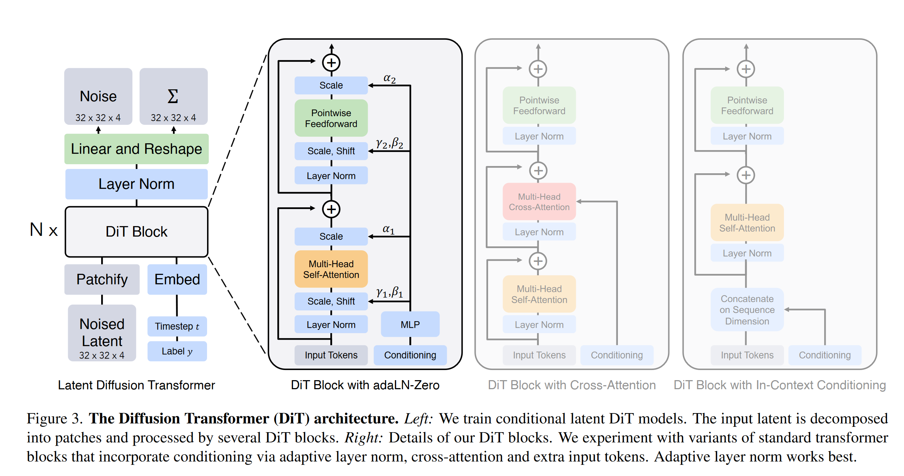

文章提出了经典的diffusion transformer。Dit的核心思想是使用transformer代替原本在扩散模型中负责预测噪声的U-net。使用transformer之后的扩散模型可以有效应对规模更加庞大的数据集，并更加有效利用各种类型的监督信息。

具体结构如图：

中间的dit block由vit block经过微调得到。文章一共给出了四种可能得设计形式，分别是：

- 自适应层数（adaLN），这个设计与GAN和扩散模型一致，通过mlp将条件映射至可以利用的token形式。

- 交叉注意力机制，将外部监督条件和image token一同送入交叉注意力模块，但是这种做法会提升计算量。

- in-context conditioning，直接将监督信息例如时间步骤，类别等等拼接成一个新token，然后和原本的image token拼接送入训练。

最后采用了自适应层数范式。模型规模越大，patchsize越小，生成效果越好。