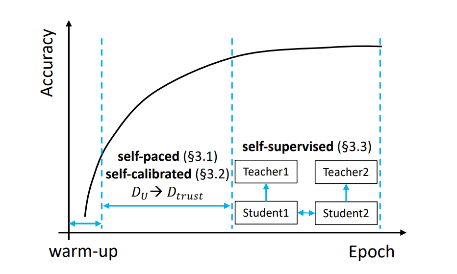

# self-PU

文章提出了一种新颖的PUL问题框架。先前的PUL方法集中精力于损失敏感上面，直接将未标记样本作为负样本进行损失优化，然后对于未标记样本中各个样本赋予不同权重进行学习。问题也很明显：面对有效容量大，可以过拟合的模型（例如DNN），分类器有严重的负分类倾向，因此有必要另寻出路解决这个问题。self-PU这篇文章提出了经典的取样（resampling method）技术，充当了很多后续工作的baseline和backbone。

总体来说self-PU的大致流程是两阶段：第一阶段，self-paced+self-calibrated。在这一阶段模型会训练两个模型（students model）。这两个模型的主要任务是一边训练，一边识别出未标记样本中可靠的正样本/负样本，加到构建的可信数据集中，我们记作$D_{trust}$。我们约定大数据集$D$指的是所有未标记样本，而$D-D_{trust}$指的是剩下的没有被纳入可信数据集中的未标记样本。可信数据集中的样本标签并不是硬标签（hard label），而是软标签$f(g(x))$，其中$g(x)$是模型对样本x的预测输出，$f$是类似于$sigmoid$之类的函数，将输出映射到$R:[0,1]$之间的一个值。除此之外，我们还根据两个学生模型的特征构造两个教师模型，之后等到$D_{trust}$达到一定规模，我们进入第二阶段，这时候引入两个教师模型，对学生模型进行蒸馏。最后得到教师模型进行PU分类任务。流程图如下：

下面主要讲解的就是三块重点：self-paced,self-calibrated,self-supervised。

# self-paced PU-learning

self-PU的第一阶段。两个学生模型的任务都是一边训练，一边修改$D_{trust}$，但是我们事先设置他们选取数据的数量不一样。例如学生模型会选取样本加入$D_{trust}$直到$size(D_{trust})= \gamma size(D)$，学生模型A的$\gamma$是0.4，而B的是0.1。这里设置两个学生模型的损失函数为：

