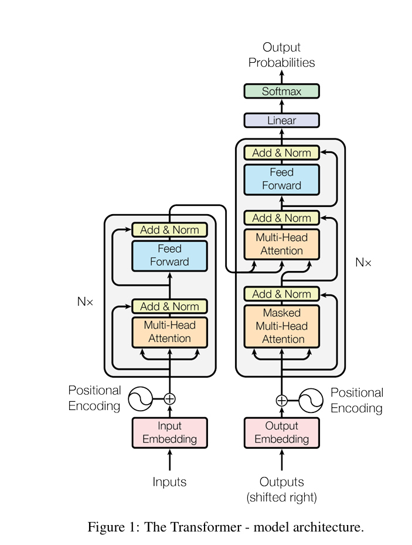
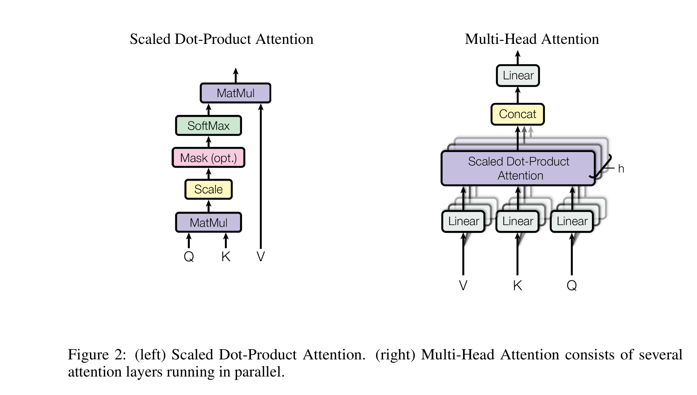

大模型的根基--大名鼎鼎的transformer降世的论文。原文链接：[Attention Is All You Need](https://arxiv.org/abs/1706.03762)。

# 背景
在当下，递归模型（如LSTM，RNN,GRNN）已经在序列建模和机器翻译等任务上取得了最好的性能。但是这些递归性模型统一面临着固定的顺序计算特性的问题，这使得模型面对长序列时发掘样本不同部分位置元素之间的关联性异常困难。为了解决这个问题，已有研究将注意力机制引入递归模型当中，并取得了明显改进。

本文中提出了一种完全摒弃递归结构网络，完全依靠注意力机制捕捉输入与输出之间的全局相关性的模型--transformer。transformer采用了自注意力和多头注意力机制。

# 模型结构
开始之前可以了解一下[自注意力机制](https://www.void2024.top/posts/%E6%B7%B1%E5%BA%A6%E5%AD%A6%E4%B9%A0-basic%20concept).

transformer依然是基础的encoder-decoder结构。每层encoder由两层组成--一层注意力层，一层sublayer。在每层注意力层中，对输入输出采用attention function计算得出输出，并和输入残差连接，进入下一层：
$$\text{Attention}(Q, K, V) = \text{softmax}\left(\frac{QK^T}{\sqrt{d_k}}\right)V$$

在这里我们使用了scaling factor $\sqrt{d_K}$, 这是因为当输入维度$d_k$非常大时，得到的点积数值也会非常大，通过softmax得到的结果很容易偏转到0和1,因此对他们进行缩放。每一层的值向量和键向量由输入和W矩阵相乘得到，每一层的W矩阵可能会有不同。

接着在每一个注意力层之后接一个子层：
$$LayerNorm=x+SubLayer(x)$$
$$SubLayer(x)=\text{max}(0, xW_1 + b_1)W_2 + b_2$$

子层用于进一步通过线性变换提取信息，可以理解为两个size = 1的卷积核的拼接。模型结构图如下：

同时还采用了多头注意力机制。多头注意力机制即在每一层encoder和decoder中加入多个注意力层。原本只有一个attention layer,现在我们数量加到h,每一个attention layer和一层一样正常计算$Q,K,V$并得到输出。之后我们将每一个头的输出组合在一起，乘以权重矩阵$W^O$得到该层输出。
$$ \text{MultiHead}(Q, K, V) = \text{Concat}(\text{head}_1, \ldots, \text{head}_h)W^O $$
where
$$ \text{head}_i = \text{Attention}(QW_i^Q, KW_i^K, VW_i^V) $$

原注意力机制和现多头注意力机制区别如下：

# 位置编码
transformer不像其他网络那样具有循环或者卷积结构，因此需要显示给出位置信息，令transformer在训练的过程中同时考虑元素位置。

$$ \text{PE}(\text{pos}, 2i) = \sin\left(\frac{\text{pos}}{10000^{2i/d_{\text{model}}}}\right) $$
$$ \text{PE}(\text{pos}, 2i+1) = \cos\left(\frac{\text{pos}}{10000^{2i/d_{\text{model}}}}\right) $$

其中pos是位置，$i$指维度。得出的位置编码和模型输入输出的维度相同，因此直接将位置编码放在encoder stack和decoder stack的底部与嵌入向量求和即可。

需要注意的是，在decoder中还需要额外令序列中当前位置之后的维度的权重为负无穷大，以控制防止向左的信息流干扰当前模型的输出。

# why self-attention?
自注意力机制和卷积，递归结构网络对比，在计算并行性，提取更长序列元素相关性方面拥有无可比拟的优势。

self-attention可以并行处理所有位置的信息，而CNN依赖于滑动窗口的移动做卷积提取信息，RNN只能按照顺序处理元素。

计算复杂度方面，self-attention计算复杂度为$O(n^2d)$,绝大多数情况下比CNN和RNN更加高效。

另外由于自注意力机制可以一次性并行考虑所有位置信息，因此在捕捉长序列信息相关性的时候非常有效，RNN在处理长数据的时候可能会面临梯度消失和爆炸的情况，导致难以学习远距离序列信息；CNN确实可以通过堆叠更多的卷积层捕捉更长序列的相关性数据，但是计算成本将会非常高。

自注意力机制在同一时间可以关注序列中所有不同位置的信息，这强化了模型的可解释性。而RNN对于当前时间点的信息关注和与其他位置的信息联系的过程十分隐晦，不同位置信息之间的关联性阐释不清；CNN倾向于关注局部的特征，而对全局性的特征捕捉解释性不强。

