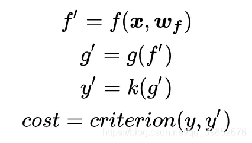
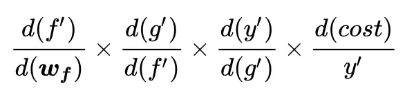

近几年深度学习领域的基础概念和模型基础。

# 残差连接
在传统神经网络中，信息会从一个层传递到下一个层，在传递的过程中会损失部分信息。在残差连接技术中，在原本layer的输出基础上又加了一个跨层的输出，将该层的输入加在了输出上，从而保留更多的信息。这个跨层链接可以看做是一个从输入到输出的捷径。

残差连接的公式为：
$$y=f(x)+x$$

前向传播时，输出和输入加在一起，作为该层新的输出传递到下一层进行处理；反向传播中，残差连接使得梯度可以更容易地传递到之前的层，加速模型收敛。

到这里就是残差连接的全部思想。我们不妨再多看一点：为何需要这一步捷径(skip connect)呢？

我们知道，神经网络通过误差损失的链式反向传播来更新参数，在一定程度上，模型的性能当然是层数越多，性能越好。但是对于计算过程中的多次求导来看：

其中$cost$对x求导为：

一旦其中一个导数非常小，就很有可能出现一系列导数求导最后发生梯度消散。但如果使用残差链接，那么梯度的最小值也能保证有一个常数项1，这时候即便有一层的导数非常小，损失也可以顺利反向传播。

残差连接的作用不仅于此，还可以挽救训练过程中权重矩阵的退化。详细可见resnet原论文。

# self-attention mechanism
注意区分 注意力机制和自注意力机制之间的区别，二者有差距。

注意力机制本质是令模型为数据的不同部分分配不同的关注程度，这种策略类似于人类大脑的注意力机制。attention mechanism 在处理序列数据和做图像处理的时候能够很好的关注不同位置数据的局部特征，并将哪怕位置很远的元素相互关联。

首先我们定义给入的询问为$query$。对于询问q，我们定义给定的输入x为：$x=[x_{1},x_{2},x_{3},......]$。

接着我们引入键向量（key）和值向量（value）。键向量的每一维值与q向量中的每一维相互对应，键向量存在的意义是帮助我们后续衡量输入中的不同元素与询问的相关性，从而决定输出。值向量表征的是实际的信息，这些信息将会在后续被加权求和得到最终的输出。

举一个例子：现在我们需要翻译（query）一个句子：i love cat, 将它翻译成法语：J'aime les chats。输入"i love cat"可以转换为词向量：
$$i → x_1$$
$$love → x_2$$
$$cat → x_3$$
引入转换矩阵$W$,计算得出源输入$x$对应的键向量：
$$K_1=W_K x_{1}$$
$$K_2=W_K x_{2}$$
$$K_3=W_K x_{3}$$
$$K=[K_1,K_2,K_3]$$

此外，我们再计算输入的值向量，将输入向量表征出来：
$$V_1=W_V x_{1}$$
$$V_2=W_V x_{2}$$
$$V_3=W_V x_{3}$$
$$V=[V_1,V_2,V_3]$$

为了得到最终的输出，我们对值向量进行加权求和得到output.如何计算呢？首先利用键向量得到他们的兼容性和加权权重。

$$score(q,K_1)=q*K_1$$
$$score(q,K_2)=q*K_2$$
$$score(q,K_3)=q*K_3$$
使用softmax将兼容性分数转化为权重：
$$[weight_1 = \frac{\exp(\text{score}(q, k_1))}{\sum_{i=1}^3 \exp(\text{score}(q, k_i))}]$$
$$[weight_2 = \frac{\exp(\text{score}(q, k_2))}{\sum_{i=1}^3 \exp(\text{score}(q, k_i))}]$$
$$[weight_3 = \frac{\exp(\text{score}(q, k_3))}{\sum_{i=1}^3 \exp(\text{score}(q, k_i))}]$$

这就是每一维元素获得的权重，最后将他们与值向量相乘求和即可得到输出向量：
$$[\text{output} = \text{weight}_1 \cdot \mathbf{v}_1 + \text{weight}_2 \cdot \mathbf{v}_2 + \text{weight}_3 \cdot \mathbf{v}_3]$$