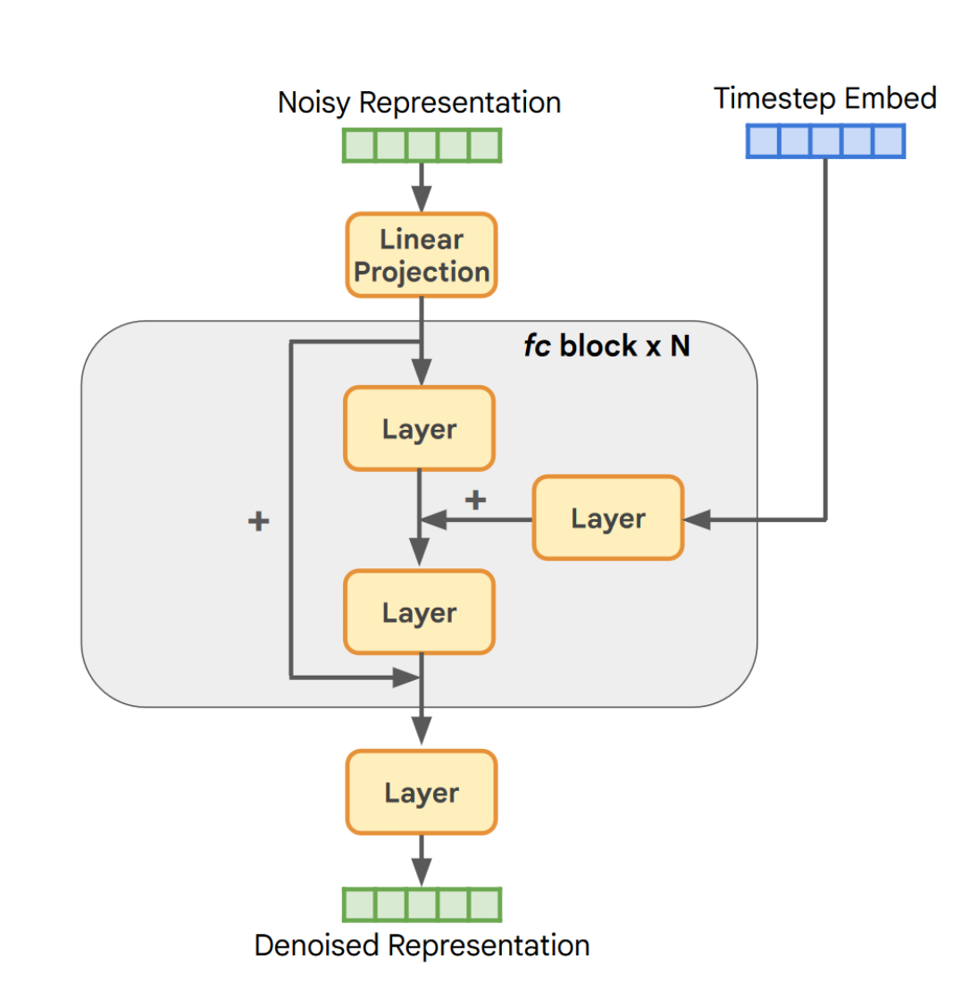
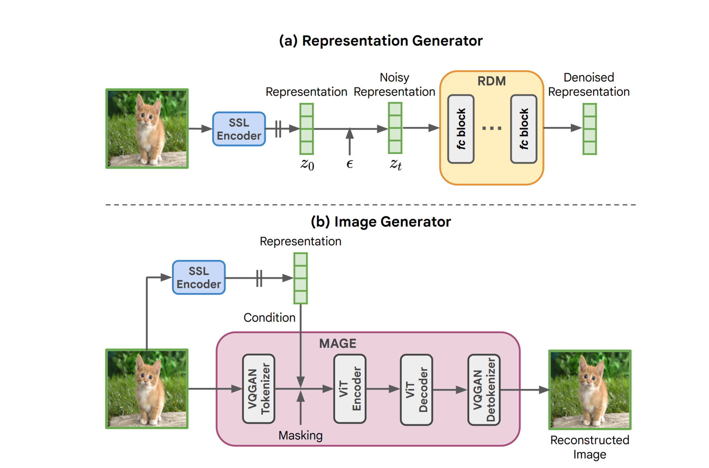

# REPRESENTATION ALIGNMENT FOR GENERATION: TRAINING DIFFUSION TRANSFORMERS IS EASIER THAN YOU THINK

考虑：可以使用外部的视觉编码器加强生成模型的表示学习。只是在这期间需要考虑这几个问题：

- 输入对齐。一般的视觉编码器处理的是干净的图片输入$x$，而扩散模型处理的是带噪声的，经过VAE压缩的输入向量$z(x)$；

- 任务对齐。visual encoder一般是为了识别和分类而建立，但是扩散模型主要用于生成。

在实验中观察到自监督视觉编码器的语义表示明显超过扩散模型，并且扩散模型自身已经表现出了和自监督视觉编码器的弱对齐，并且对齐程度是可以随着模型大小提升和数据量提升而提高的。基于这些发现，提出可以使用视觉编码器的信息作为额外的监督，引导模型生成高质量图像。

核心想法比较简单，在损失中加入对齐项。

对于一个视觉编码器$f$,它的输入是干净图像$x^*$，输出是$y^*$。我们设$h_t=f_{\theta}(z_t)$表示扩散模型在时间步t时的隐藏状态。$h_{\phi}(h_t)$是一个可训练多映射头，将扩散模型的中间隐藏状态映射到和$y^*$相同的空间中。接着定义对齐损失：

$$
\mathcal{L}_{\text{REPA}}(\theta, \phi) := -\mathbb{E}_{\mathbf{x}_*, \epsilon, t} \left[ \frac{1}{N} \sum_{n=1}^{N} \text{sim}(\mathbf{y}_*^{[n]}, h_\phi(\mathbf{h}_t^{([n])})) \right],
$$

其中$sim$是预先自定义的相似度函数。

在扩散模型训练的损失中，依靠权重$\lambda$组合成完整的损失函数：

$$
\mathcal{L} := \mathcal{L}_{\text{velocity}} + \lambda \mathcal{L}_{\text{REPA}}
$$

# Return of Unconditional Generation: A Self-supervised Representation Generation Method

这次使用无条件自生成的图像表示作为监督对提升图像生成效果，方法名为representation conditioned guidance (RCG),泛化能力强，classifier-guidance也可以被融入这套表示引导生成框架中。

大体来说，RCG核心分为三个部分：(a) image encoder，将图像转换为noisy representation； (b) representation encoder， 负责学习将带噪声的表示转换为符合原图像分布的表示； (c) image encoder， 学会使用表示的约束加强图像生成的能力。

对于表示学习，设计了一种新的模块--representation diffusion model(RDM), 负责生成可用于作为监督的表示，也就是representation generator。结构如下：

主要由一个线性映射头，还有若干个残差连接块组成，其中的主要参数就是残差块数量和向量维度。整体流程如下：

由representation generator生成表示，在image generator中作为监督进行约束。图像生成器中，对于每一个推理步骤都会进行两次操作：生成不带表示约束的logit $l_u$和带表示约束的$l_c$，每一次对于掩码token最终给出的$l_g$由两者拼接：

$$l_g = l_c + \tau (l_c - l_u)$$

$\tau$负责调节指导尺度。